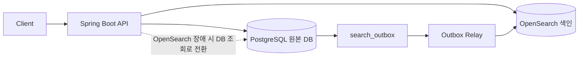

# marketplace

1,000만 상품과 2,050만 옵션 데이터를 기준으로, 상품 검색 API에서 옵션 필터·정렬·페이지 처리가 함께 들어올 때 발생하는 조회 병목을 분석한 백엔드 프로젝트입니다. PostgreSQL 튜닝, 비정규화 조회 테이블, OpenSearch 조회 모델을 같은 부하 조건에서 비교했습니다.

데이터는 실제 운영 데이터가 아니라 로컬 합성 데이터입니다. 옵션 조인과 뒤 페이지 조회 병목이 안정적으로 드러나도록 상품·옵션 규모와 분포를 통제했습니다.

---

## 배경

상품 검색에서는 카테고리, 브랜드, 가격, 색상, 사이즈, 재고 상태가 함께 조합됩니다. 조건이 많아질수록 단순 목록 조회가 아니라 옵션 조인, 정렬, 페이지 처리가 함께 걸리는 검색 조회 문제가 됩니다.

초기 구조는 정규화된 `products`, `product_options` 테이블을 직접 조회하는 방식입니다. 옵션 필터가 들어오면 `1:N` 관계의 조인이 발생하고, 중복 상품을 제거하기 위해 `DISTINCT`가 붙습니다. 여기에 정렬과 뒤 페이지 조회가 결합되면서 응답 시간이 크게 늘어났습니다.

비정규화 조회 테이블은 검색 API 응답에 필요한 상품 기본 정보와 정렬·필터링 값을 미리 모아둔 DB 내부 조회 모델입니다. 매 요청마다 `products`와 `product_options`를 조합하지 않고, 검색 조건에 맞게 준비된 데이터를 조회해 조인과 중복 제거 비용을 줄입니다.

| 조회 방식         | 설명                                            |
| ------------- | --------------------------------------------- |
| 기존 DB 조회      | 정규화된 `products`, `product_options` 테이블을 직접 조회 |
| DB 튜닝 후 조회    | 인덱스, pagination, `EXISTS` rewrite를 적용한 DB 조회  |
| 비정규화 조회 테이블   | 검색 응답에 필요한 필드를 미리 맞춘 DB 내부 조회 모델              |
| OpenSearch 조회 | 상품 검색 전용 색인을 사용하는 조회 모델                       |

---

## 범위

이 프로젝트는 쇼핑몰 전체 기능보다 상품 검색 API의 조회 구조에 초점을 맞춥니다.

회원, 주문, 결제, 장바구니, 관리자 기능, CI/CD, 모니터링 구성은 현재 범위에 포함하지 않았습니다. 대신 상품 검색 조건, 옵션 조인, 조회 모델 비교, OpenSearch 전환 검증에 필요한 코드와 artifact를 중심으로 구성했습니다.

주요 산출물은 다음과 같습니다.

* 상품 검색 조건과 옵션 필터 병목 재현
* PostgreSQL 인덱스와 쿼리 구조 비교
* 비정규화 조회 테이블과 OpenSearch 조회 모델 비교
* k6 기반 API 응답 시간과 처리량 측정
* OpenSearch 전환 과정의 색인, 동기화, 정합성, fallback 검증
* 일반 쇼핑몰 도메인 기능보다 병목 재현과 측정 artifact에 집중한 구조

---

## 문제를 나눈 방식

검색이 느려지는 원인을 한 번에 OpenSearch로 넘기지 않고 작은 단위로 분해했습니다.

| 단계                | 확인한 내용                                  | 남긴 판단                           |
| ----------------- | --------------------------------------- | ------------------------------- |
| `products` 단일 테이블 | 필터, 정렬, 페이지 처리 비용                       | 조인을 제외하고 기본 조회 비용을 먼저 분리        |
| 인덱스 비교            | 단일 인덱스, 복합 인덱스, 부분 인덱스                  | 어떤 인덱스가 유효하고 어떤 시도가 제한적인지 확인    |
| 페이지 처리            | `OFFSET`과 keyset pagination             | 뒤 페이지 조회에서 pagination 방식의 차이 확인 |
| 옵션 조인             | `product_options` 조건과 `JOIN + DISTINCT` | 1:N 조인과 중복 제거 비용 재현             |
| 쿼리 재작성            | `JOIN + DISTINCT`와 `EXISTS` 비교          | 옵션 조건을 row 존재 여부로 처리할 때의 효과 확인  |
| 조회 모델 분리          | 비정규화 조회 테이블과 OpenSearch 비교              | 정규화 테이블 직접 조회 외의 대안 비교          |
| 검색 전환 검증          | backfill, outbox, dual-run, fallback    | 조회 모델 분리 뒤 새로 생기는 운영 문제 확인      |

---

## 측정 결과

최종 비교에는 `moderate_skew` 부하 조건을 사용했습니다.

`moderate_skew`는 모든 컬럼이 균등한 상황도, 일부 값에 극단적으로 몰린 상황도 아닌 중간 정도의 편중 프로필입니다. `uniform`은 균등 분포에서 쿼리 구조를 확인하기 위한 기준, `high_skew`는 특정 조건에 더 강하게 몰리는 상황을 보기 위한 프로필입니다.

| 구분               | `uniform`           | `moderate_skew`        | `high_skew`        |
| ---------------- | ------------------- | ---------------------- | ------------------ |
| 목적               | 균등 분포 기준선           | 대표 측정 프로필              | 더 강한 편중 확인용        |
| 해석               | 조건 선택도가 비교적 고르게 나타남 | 일부 조건에 요청과 데이터가 몰리는 상황 | 특정 조건에 더 크게 몰리는 상황 |
| 이번 README의 최종 비교 | 사용하지 않음             | 사용                     | 사용하지 않음            |

`moderate_skew`의 상품 상태 분포는 ACTIVE 900만, DELETED 30만, SOLD_OUT 70만입니다. 옵션은 총 2,050만 건이며, 최종 k6 시나리오는 선택적 옵션 필터, 넓은 active 옵션 필터, 뒤 페이지 옵션 필터를 40:40:20 비율로 섞었습니다.

| 시나리오                          |  비중 | 조건 요약                                                                                | 의도                     |
| ----------------------------- | --: | ------------------------------------------------------------------------------------ | ---------------------- |
| B1 selective option filter    | 40% | 특정 category, brand, price range, `BLACK / M / IN_STOCK`, review count 정렬, offset 100 | 선택도가 있는 옵션 필터 조회       |
| B2 broad active option filter | 40% | ACTIVE 상품 중 `BLACK / M / IN_STOCK`, created at 정렬, offset 100                        | 넓은 범위의 active 옵션 필터 조회 |
| B3 deep offset option filter  | 20% | B1과 같은 조건, offset 10000                                                              | 뒤 페이지 조회 비용 확인         |

대표 실행 조건은 VU 10, warm-up 1분, measured run 10분입니다.

| 조회 방식         |   p95 응답 시간 |        처리량 | 해석                                  |
| ------------- | ----------: | ---------: | ----------------------------------- |
| 기존 DB 조회      | 29611.60 ms |   0.63 RPS | 옵션 조인과 중복 제거 비용이 API 응답 시간에 그대로 드러남 |
| DB 튜닝 후 조회    |   370.31 ms |  51.85 RPS | 인덱스와 쿼리 개선만으로 큰 폭 개선                |
| 비정규화 조회 테이블   |   127.34 ms | 276.14 RPS | 정확한 옵션 필터와 높은 처리량에서 강점              |
| OpenSearch 조회 |    98.90 ms | 176.28 RPS | 전체 응답 시간과 뒤 페이지 조회에서 강점             |

OpenSearch가 모든 조건에서 가장 좋은 결과를 내지는 않았습니다. 정확한 옵션 필터와 높은 처리량이 중요한 조건에서는 비정규화 조회 테이블이 더 유리했고, OpenSearch는 전체 응답 시간과 뒤 페이지 조회, 검색 기능 확장성에서 강점을 보였습니다.

상세 수치와 시나리오별 결과는 `docs/product-search-read-path-results/README.md`에서 관리합니다.

---

## OpenSearch 전환에서 확인한 문제

OpenSearch는 PostgreSQL을 대체하는 저장소가 아니라 검색용 조회 모델입니다. 원본 데이터는 PostgreSQL에 두고, 검색 색인은 별도로 구성했습니다.

별도 색인을 두면 DB 단독 조회에는 없던 문제가 생깁니다. 기존 데이터 색인, DB 변경분 반영, DB/Search 결과 불일치 확인, 검색 장애의 API 전파 차단이 필요합니다.

| 구분     | 항목                  | 확인한 내용                                                    |
| ------ | ------------------- | --------------------------------------------------------- |
| 색인 구조  | nested mapping      | 색상, 사이즈, 재고 상태가 같은 옵션 row 안에서 함께 만족되는지 확인                 |
| 색인 구조  | alias               | 물리 index를 직접 바라보지 않고 read/write/current alias로 전환 가능하게 구성 |
| 초기 적재  | backfill            | 기존 PostgreSQL 상품 데이터를 OpenSearch 색인으로 적재                  |
| 초기 적재  | checkpoint / resume | backfill 중단 이후 이어서 처리할 수 있는 흐름 확인                         |
| 변경 동기화 | outbox relay        | DB 변경 사항을 검색 색인에 반영하는 동기화 흐름 구성                           |
| 변경 동기화 | catch-up replay     | backfill 이후 발생한 변경 이벤트를 다시 반영                             |
| 정합성 확인 | DB/Search dual-run  | 같은 검색 조건에서 DB 결과와 OpenSearch 결과를 비교                       |
| 장애 대응  | fallback / rollback | 문제가 생겼을 때 DB 조회와 이전 index로 되돌아가는 경로 확인                    |
| 장애 대응  | circuit breaker     | 반복적인 OpenSearch 실패가 모든 요청을 지연시키지 않도록 차단                   |

backfill은 전체 데이터를 한 번 넣는 작업으로만 두지 않았습니다. 중간에 끊겨도 마지막 처리 지점을 기준으로 이어서 적재할 수 있도록 checkpoint를 남겼고, backfill 이후 발생한 변경 이벤트는 catch-up replay로 반영했습니다. 이후 같은 검색 조건에서 DB 결과와 OpenSearch 결과를 비교해 전환 전 차이를 확인했습니다.

---

## 구조



PostgreSQL은 원본 데이터 저장소로 유지했습니다. OpenSearch는 검색 전용 색인으로 분리했고, `search_outbox`와 Relay가 DB 변경분을 색인에 반영합니다. OpenSearch 장애 시 fallback의 기본 경로는 PostgreSQL 기반 DB 조회입니다.

---

## 기술 스택

| 분류                | 기술              |
| ----------------- | --------------- |
| Language          | Java 21         |
| Framework         | Spring Boot 3.4 |
| Database          | PostgreSQL      |
| Search            | OpenSearch      |
| Load Test         | k6              |
| Local Environment | Docker Compose  |

---

## 문서와 결과 파일

```text
benchmark/k6/
├── README.md
└── results/products_moderate_skew/

db/experiments/
├── a1-*
└── ...

docs/
└── product-search-read-path-results/
    └── README.md
```

* 결과 정리 문서: `docs/product-search-read-path-results/README.md`
* k6 부하 테스트 문서: `benchmark/k6/README.md`
* k6 결과 파일: `benchmark/k6/results/products_moderate_skew/`
* DB 실험 자료: `db/experiments/`

---

## 한계

* 로컬 Docker 환경에서 만든 합성 부하 기준이며, 실제 운영 트래픽을 재현한 결과가 아닙니다.
* 1,000만 상품과 2,050만 옵션 데이터는 실제 서비스 데이터가 아니라 옵션 조인과 페이지 처리 병목을 드러내기 위한 실험 규모입니다.
* k6 부하는 병목을 비교하기 위한 실험용 부하입니다.
* OpenSearch 관련 검증은 전환 절차를 로컬에서 확인한 것이며, 운영 환경의 전체 장애 대응을 의미하지 않습니다.
